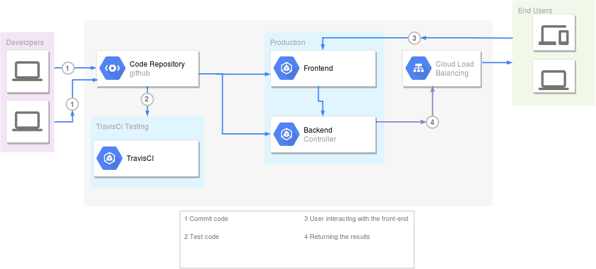
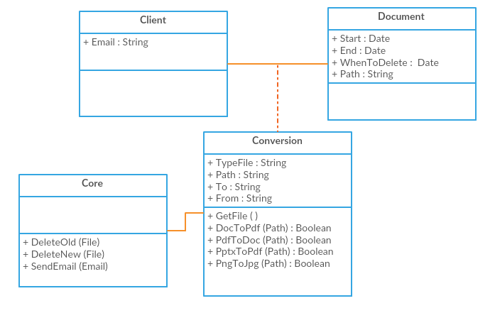

  
  
  
  

<a href="https://stark-wave-19861.herokuapp.com/">

</a>
# Sunlight

## Sommaire :
- Fonctionnement de l'application
- Architecture de l'application
  - Architecture global de l'application 
  - L'architecture de la couche donnée
  - Manière de gestion des demandes des clients
  - Les technologies choisie pour développer l'application.
  
### Fonctionnement de l'application :
-	Un client se rend sur la page d'accueil de l'application. Il y dépose son document, choisit les conversions à réaliser parmi celles disponibles et un e-mail de contact (facultatif).
-	Une fois la demande enregistrée, l'application envoie un message (facultativement : un e-mail) confirmant que l'opération est en cours et un lien vers une page résumant le statut de chaque conversion : en attente, en cours, terminé. Pour chaque statut, il est important de connaître le temps passé dans l'état courant.
-	Lorsqu'un document est converti, un lien est mis à disposition depuis la page de statut permettant de le télécharger. L’utilisateur dispose alors de 5 minutes pour le télécharger après quoi le document sera supprimé.
-	Quand le document a été converti, un message (facultativement : un e-mail) est envoyé à l'utilisateur avec le lien.
-	Pour chaque utilisateur, il est possible de réaliser seulement 2 conversions à la fois.

### L'architecture global de l'application :
Spring MVC est la bibliothèque d'infrastructure Spring traditionnelle pour la création d'applications Web Java, la structure Spring Web`MVC` fournit une architecture modèle-vue-contrôleur ([MVC](https://en.wikipedia.org/wiki/Model%E2%80%93view%E2%80%93controller)) et des composants prêts à l'emploi qui peuvent être utilisés pour développer des applications Web flexibles et des petits services, c'est pour cela qu'on a opté pour l'architecture `MVC` que l'architecture micro-services qui est utilisée dans les grands projects, et cela ne reflète pas sur le travaille demandé.

1. View: notre front-end (fondamentalement `JSP` code).
2. Controller: gérer les demandes `HTTP` (`POST`, `GET`).
3. Core: C'est le noyau de l'application qui gère la suppression des fichiers, envoi un e-mail au clients et la conversion des fichiers.
 

### L'architecture de la couche des données :
On va travailler avec sql (`sqlite`) parce-que c'est lèger et notre base de donnée est petite.
Spring Boot créera automatiquement une base de données intégrée et une `DataSourceinstance` dans le contexte de l'application,une fois les dépendances définies, `Spring Boot` fournira les configurations par défaut pour l'application. Bien sûr, nous pouvons modifier les configurations si nous le souhaitons, mais grâce à `Spring Boot`, nous avons une longueur d'avance: une application prête à l'emploi entièrement configurée.

### Manière de gestion des demandes :
La maniere la plus efficace c'est d'utiliser `TaskExecutor` du package spring qui gere les `threads` d'ou l'utilisation de plusieurs threads (processus legers) permet de paralléliser le traitement et de l'executer rapidement.

### Technologies choisis pour développer l'application :
- Platforme de déploiement Cloud [openshift](https://openshift.io/) qui offre un plan OnlineStarter d'ou cette solution est gratuite et permet de créer deux conteneurs de `Kubernetes` de 1GB .
- [Spring MVC](https://docs.spring.io/spring/docs/current/spring-framework-reference/web.html) à l'aide de `Spring Boot` et `Spring Initializr`.
- [Spring Cloud](https://spring.io/projects/spring-cloud#overview) qui se base sur `Spring Boot` et qui offre les outils nécessaires pour concevoir une application `Cloud Ready`
- [Tomcat](http://tomcat.apache.org/) d'ou `Spring Boot` inclura et configurera automatiquement `Tomcat` dans le cadre de l'exécution de l'application .
-  Langage Java,Platforme IntelliJ
-  Tirer part de la librairie [Documents4J](http://documents4j.com/) qui offre plusieurs types de conversion de documents .
